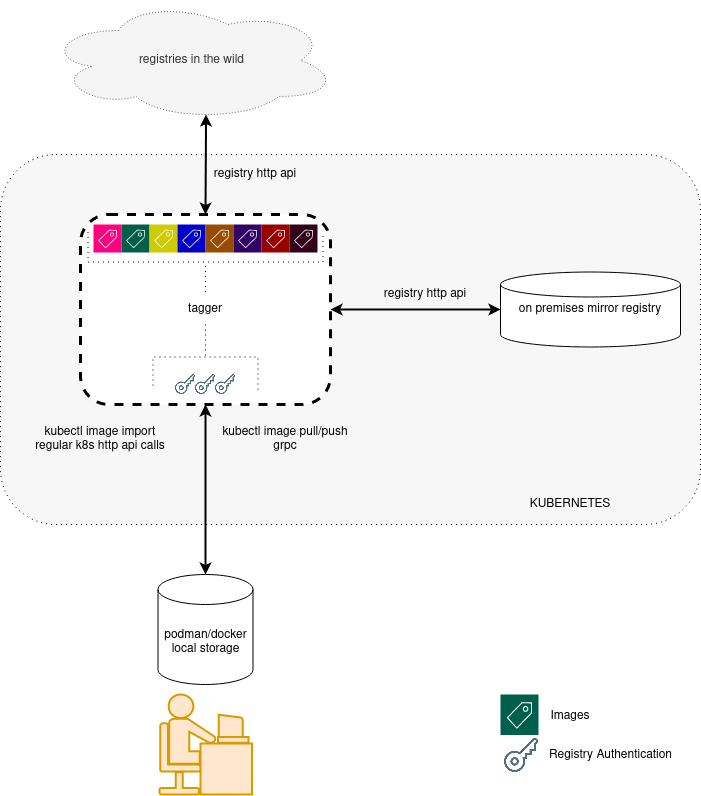

### Motivation

Keeping track of all Container Images in use in a Kubernetes cluster is a complicated task.
Container Images may come from numerous different Image Registries. In some cases, controlling
how a stable version of a given Container Image looks escapes the user's authority. To add to
this, Container Runtimes rely on remote registries (from the cluster's point of view) when
obtaining Container Images, potentially making the process of pulling their blobs (manifests,
config, and layers) slower.

The notion of indexing Container Image versions by tags is helpful. Still, it does not provide
users with the right confidence to always use the intended Container Image – today's "latest"
tag might not be tomorrow's "latest" tag. In addition to that, these Image Registries allow
access to Container Images by their Manifest content's hash (i.e., usually sha256), which gives
users the confidence at a cost in semantics.

When releasing a new version of an application to Push and to Deploy are split into two distinct
steps. Both the pusher and the puller need access to the same Image Registry, adding complexity.
Credentials are one example of the concerns. Other factors may pop up when running, for instance,
in an air-gapped environment, where the cluster may not reach external Image Registries.

Tagger aims to overcome these caveats by providing an image management abstraction layer. For
instance, by providing a direct mapping between a Container Image tag (e.g., "latest") and its
correspondent Manifest content's hash.

When integrated with a Internal or Mirror Registry, Tagger allows users to push or pull Images
directly without requiring an external Image Registry. It works as a layer between the user and
the Internal Registry.

In summary, Tagger mirrors remote Container Images into a Kubernetes cluster, provides an
interface allowing users to pull and push images directly to the Kubernetes cluster.

### Some concepts

Images in remote repositories are tagged using a string (e.g. `latest`), these tags are not
permanent (i.e. the repository owner may push a new version for a tag at any given time).
Luckily users can also refer to images by their hashes (generally sha256) therefore one can
either pull an image using its tag (`docker.io/fedora:latest`) or utilizing its hash
(`docker.io/fedora@sha256:0123...`). Tagger takes advantage of this registry feature and
creates references to image tags using their respective hashes (a hash, in such a scenario,
may be considered a "fixed point in time" for a given image tag). Every time one imports an
image Tagger creates a new reference for that image tag,

### Architecture



### Mirroring images

Tagger allows administrators to mirror images locally within the cluster. You need to have an
image registry running inside the cluster (or anywhere else) and ask `Tagger` to do the mirror.
By doing so a copy of the remote image is going to be made into the mirror registry.

### How to use

Tagger leverages a _custom resource definition_ called Image. An Image represents an image tag
in a remote registry. For instance, a Image called `myapp-devel` may be created to keep track of
the image `quay.io/company/myapp:latest`. An Image _custom resource_ layout looks like this:

```yaml
apiVersion: tagger.dev/v1beta1
kind: Image
metadata:
  name: myapp-devel
spec:
  from: quay.io/company/myapp:latest
  mirror: false
  insecure: false
```

Users can mirror an Image by running the following command:

```
$ kubectl image import operator --from quay.io/tagger/operator:latest --mirror
```

This will create an Image called `operator` and once that is done a new ImageImport instance
will be created (Tagger will act on created ImageImport and assure the image is imported). After
a few seconds the ImageImport should be present in the namespace:

```
$ kubectl get imageimports.tagger
NAME                INSECURE   MIRROR   TARGETIMAGE   IMPORTEDAT             IMAGEREFERENCE
operator-efe3380a   false      true     operator      2022-02-06T19:06:24Z   <redacted>
```

Once it is imported we can see the image reference inside the `operator` Image:

```
$ kubectl get images.tagger operator -o yaml
apiVersion: tagger.dev/v1beta1
kind: Image
metadata:
  name: operator
  namespace: namespace
spec:
  from: quay.io/tagger/operator:latest
  insecure: false
  mirror: true
status:
  hashReferences:
  - from: quay.io/tagger/operator:latest
    imageReference: <redacted>
    importedAt: "2022-02-06T19:06:24Z"
```


### Image structure

On an Image `.spec` property these fields are valid:

| Property   | Description                                                                       |
| ---------- | --------------------------------------------------------------------------------- |
| from       | Indicates the source of the image (from where Tagger should import it)            |
| mirror     | Informs if the Image should be mirrored to another registry, more on this below   |
| insecure   | Indicates that Tagger should skip tls verification during the image import/mirror |


#### Mirroring images locally

If mirroring is set in an Image Tagger will mirror the image content into another registry provided
by the user.  To mirror images locally one needs to inform Tagger about the mirror registry
location. There are two ways of doing so, the first one is by following a Kubernetes enhancement
proposal laid down [here](https://bit.ly/3rxCRqH). This enhancement proposal still does not cover
things such as authentication thus should not be used in production. Tagger can also be informed
of the mirror registry location through a Secret called `mirror-registry-config`, this secret may
contain the following properties:

| Name       | Description                                                                       |
| -----------| --------------------------------------------------------------------------------- |
| address    | The mirror registry URL                                                           |
| username   | Username Tagger should use when accessing the mirror registry                     |
| password   | The password to be used by Tagger                                                 |
| token      | The auth token to be used by Tagger (optional)                                    |
| insecure   | Allows Tagger to access insecure registry if set to "true" (string)               |
| repository | If set Tagger will mirror all images inside the same Registry repository          |

Follow below an example of a `mirror-registry-config` Secret:

```yaml
apiVersion: v1
kind: Secret
metadata:
  name: mirror-registry-config
  namespace: tagger
data:
  address: cmVnaXN0cnkuaW8=
  username: YWRtaW4=
  password: d2hhdCB3ZXJlIHlvdSB0aGlua2luZz8K
```

Mirrored Images are stored in a repository with the Namespace's name used for the Image, for
example, an Image living in the `development` namespace will be mirrored in
`internal.registry/development/` repository.

#### Importing images from private registries

Tagger supports importing images from private registries, for that to work one needs to define a
secret with the registry credentials on the same Namespace where the Image lives. This secret must
be of type `kubernetes.io/dockerconfigjson`. You can find more information about these secrets at
https://kubernetes.io/docs/tasks/configure-pod-container/pull-image-private-registry/

### Image status

Follow below the properties found on an Image`.status` property and their meaning:

| Name              | Description                                                                |
| ----------------- | -------------------------------------------------------------------------- |
| references        | A list of all imported references (aka generations)                        |

The property `.status.references` is an array of imports executed, Tagger currently holds up to
twenty five references for any given imabe. Every item on the array is composed of the following
properties:


### Image import

Users can also import new Images by creating instances of ImageImport CR:

```yaml
apiVersion: tagger.dev/v1beta1
kind: ImageImport
metadata:
  name: myapp-0
spec:
  from: docker.io/library/nginx:latest
  insecure: false
  mirror: false
  targetImage: nginx
status:
  hashReference:
    from: docker.io/library/nginx:latest
    imageReference: <redacted>
    importedAt: "2022-02-06T20:37:46Z"
  importAttempts:
  - succeed: true
    when: "2022-02-06T20:37:46Z"
```

The field `.spec.targetImage` is mandatory. All other `.spec` fields are optional and if not
provided their values are inherited from the Image pointed by `.spec.targetImage`. The status
of an ImageImport CR shows the result of all attempts made to import the image under the field
`.status.importAttempts`. Ten attempts are made to import an Image.

In case of success during the import the `.status.hashReference` contains the image reference,
its fields are:

| Name           | Description                                                                   |
| -------------- | ----------------------------------------------------------------------------- |
| from           | From where this image was imported, generally points to an image by tag       |
| importedAt     | Date and time of the import                                                   |
| imageReference | Where this reference points to (by hash), may point to the mirror registry    |

As for `.status.importAttempts` the following is valid:

| Name    | Description                                                                          |
| ------- | ------------------------------------------------------------------------------------ |
| when    | Date and time of the import attempt                                                  |
| succeed | A boolean indicating if the import was successful or not                             |
| reason  | In case of failure (succeed = false), what was the error                             |


### Deploying

You can install Tagger in your cluster using [OperatorHub](https://operatorhub.io/operator/tagger).
For manual install read below.

_The documentation below may not be the right one for the version you want to install.  It is
recommended that you refer to the documentation specific to the version you are willing to deploy.
Download a file called `README.pdf` or `README.md` for the release in the Releases section of this
repository._

You can deploy Tagger using Helm, let's first select the release we want to install by running
the following commands:

```
$ RELEASE=v2.1.17
$ BASEURL=https://github.com/ricardomaraschini/tagger/releases/download
```
The `RELEASE` variable may be set to any release, to see a full list of releases follow the link
https://github.com/ricardomaraschini/tagger/releases. Once the release is chosen and the variables
are set you can then procceed to install the operator by running:

```
$ helm install tagger $BASEURL/$RELEASE/tagger-$RELEASE.tgz
```

You can also get a list of what can be customized during the install by running the following
command:

```
$ helm show values $BASEURL/$RELEASE/tagger-$RELEASE.tgz
```

By default Tagger won't be able to mirror until you provide it with a mirror registry config.
After install you can configure the mirror by editing the Secret `mirror-registry-config` in
the operator namespace. Follow below an example of a valid `mirror-registry-config` secret
(you gonna have to provide your own `address`, `username`, `password`, etc):

```yaml
apiVersion: v1
kind: Secret
metadata:
  name: mirror-registry-config
data:
  address: cmVnaXN0cnkuaW8=
  username: YWRtaW4=
  password: d2hhdCB3ZXJlIHlvdSB0aGlua2luZz8K
  token: YW4gb3B0aW9uYWwgdG9rZW4gZm9yIHRva2VuIGJhc2VkIGF1dGg=
  insecure: dHJ1ZQ==
```

You can provide your own certificate and Tagger will leverage it for serving images when
users pull or push. This certificate is also used when Kubernetes asks to validate a given
Tag.  To provide your certificate use Helm chart `key` and `cert` variables. Important to
notice that the certificate must be valid for the following alternative names:

```
- mutating-webhooks.<tagger namespace>.svc.
	- this name is used when kubernetes api server validates images.
- the ingress name.
	- users will use this to reach tagger when pulling or pushing.
```

If you don't provide any certificate during installation a self signed one will be created and
deployed, it is valid for one year. You can update the certificates whenever you want, for that
you need to edit a secret called `certs` in Tagger's namespace and a mutating webhook config
called `tagger`.

```
$ kubectl edit secret certs
$ kubectl edit mutatingwebhookconfigurations tagger
```

### Building kubectl plugin

To build the kubectl image plugin you gonna need to install a few dependencies. Depending on the
distribution you are using the packages may be named differently. To install on a Fedora release
you can use the following commands (from within Tagger's repository root directory):

```
sudo dnf install -y \
	make \
	go \
	gpgme-devel \
	btrfs-progs-devel \
	device-mapper-devel
make kubectl-image
sudo mv output/bin/kubectl-image /usr/local/bin/kubectl-image
```

You gonna need `go` to be at least version `1.16`. To build in an Ubuntu distribution, after
installing `go >= 1.16`, you can run the following commands:

```
sudo apt install -y \
	make \
	libbtrfs-dev \
	libgpgme-dev \
	libdevmapper-dev \
	uidmap
make kubectl-image
sudo mv output/bin/kubectl-image /usr/local/bin/kubectl-image
```
